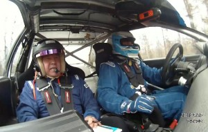
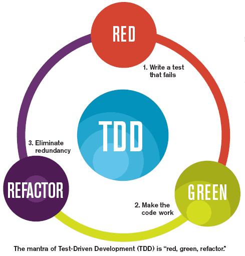

# Coding Dojo

---

# O que é?

---

# Programadores + Prática + Desafio + Aprendizado + Diversão

---

# Por que?

---

# Não temos o hábito de treinar

---

# Dojo _não_ é **exibição**

---

# Dojo _não_ é **competição**

---

# Então como funciona?

---

# TDD - Test-Driven Development

- Os testes guiam o desenvolvimento
- Não se escreve código antes que exista um teste para ele

---

# Baby steps

- Passos de bebê
- O desenvolvimento é feito de pequenos incrementos no código
- Cada novo teste cobre o mínimo incremento de funcionalidade possível
- O código muda o mínimo possível para fazer o teste passar

---

# Programação em pares

- Um programador _dirige_ e outro _lê o mapa_ 

---

# Refatoração

- Eliminar código duplicado ou sem uso
- É uma opção quando os testes estão passando

--- 

# Ciclo do desenvolvimento

- Adicionar um teste
- Executar testes que falham
- Fazer uma pequena mudanças
- Executar testes que passam
- Refatorar para remover duplicações

---

# O _mantra_ do TDD

 

---

# Material

- Computador
- Editor de texto
- Compiladores/interpretadores
- Projetor
- Cadeiras

---

# Pessoas

- Piloto + co-piloto
- _Sensei_
- Especialista na linguagem escolhida

---

# Antes de começar, escolhemos...

- Problema
- Linguagem

---

# Randori kata

- Um piloto e um co-piloto vêm da plateia
- Após um determinado período de tempo (5-7 min.)
	- Piloto volta para a plateia
	- Co-piloto assume o lugar do piloto
	- Novo co-piloto vem da plateia
- O ideal é que **todos** programem
- Plateia só se manifesta no _sinal verde_ (testes passando)

---

# Vamos lá?

[Sugestões de Problemas](problemas.html)

